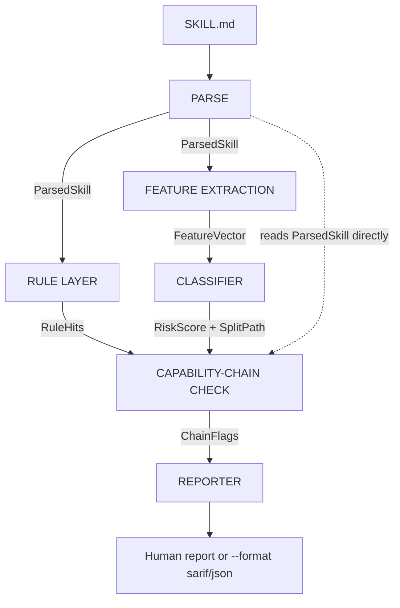

# PromptHound

**PromptHound** is an offline static risk analysis CLI for AI agent skill files (`SKILL.md`, `AGENTS.md`). It detects malicious instructions, steganographic payloads, and suspicious capability chains before you give a third-party skill file to your agent.

*Philosophy: Sniffer, not shield. Detect, score, explain. The final call stays with the developer or CI pipeline.*

## 1. The Problem

AI coding agents load third-party "skills" to learn capabilities and rules. Unlike npm or PyPI packages, these payloads are natural-language instructions.

Traditional static analysis and sandboxing tools miss these because the exploit can be a single sentence:
- **Credential Stealing:** The "ClawHavoc" campaign compromised over 1,000 skills, embedding stealers in setup instructions.
- **Steganography:** Invisible Unicode Tag characters (U+E0000–U+E007F) hide instructions from human reviewers.
- **Capability Chaining:** Benign capabilities chained together (e.g., read a file → encode it → send it) to exfiltrate data.
- **Scanner Evasion:** Padding files with junk data to bypass marketplace scanner size limits.

PromptHound runs in under a second. Run it before you `git clone` a skill.

## 2. Architecture & Flow

PromptHound runs a linear pipeline with a rule-based side-channel. Deterministic rules and statistical machine-learning scores are kept distinct.



## 3. Installation & Setup

PromptHound is built in Python 3.11+. It uses no external databases or network calls.

```bash
# Clone the repository
git clone https://github.com/knownasnaffy/prompthound
cd prompthound

# Create a virtual environment
python3.11 -m venv .venv
source .venv/bin/activate

# Install the package in editable mode
pip install -e ".[dev]"
```

## 4. Usage

Run PromptHound against any markdown skill file:

```bash
# Standard human-readable output
prompthound scan path/to/SKILL.md

# Structured JSON output
prompthound scan path/to/SKILL.md --format json

# SARIF format for CI/CD integration
prompthound scan path/to/SKILL.md --format sarif

# Exit with a non-zero code if risk meets a threshold
prompthound scan path/to/SKILL.md --fail-on suspicious
```

### Risk Thresholds
- **Benign (<0.3):** Standard skill file.
- **Suspicious (0.3 - 0.65):** Some anomalous features present. Worth manual review.
- **Malicious (≥0.65):** Strong signals of steganography, data exfiltration pipelines, or encoded payloads.

## 5. Evaluation Results

PromptHound uses a **Random Forest classifier (n_estimators=50, max_depth=10, min_samples_leaf=1)** to score feature vectors.

On the expanded benchmark corpus (2000+ files):
- **Precision / Recall / F1:** Precision 0.971 / Recall 0.872 / F1 0.919 on a 403-file holdout test set.
- **False Positive Rate (FPR):** 0.00 on a challenging `benign_unusual` probe set (legitimate skills with valid shell/base64 usage).

The classifier surfaces the local feature contributions (via Saabas decomposition) that drove each score (e.g., how much base64 ratio or body entropy contributed to the risk score). For full details, see `docs/evaluation_report.md`.

## 6. Comparison with Alternative Tools

Other security scanners take different architectural approaches:

- **[NVIDIA SkillSpector](https://github.com/NVIDIA/skillspector)**: Sends skills to LLMs for semantic evaluation and queries OSV.dev for live vulnerability data.
- **[Cisco skill-scanner](https://github.com/cisco-ai-defense/skill-scanner)**: Combines static YARA rules with LLM-as-a-judge and behavioral dataflow analysis, specifically targeting OpenAI Codex and Cursor Agent rules.
- **[Tencent AI-Infra-Guard](https://github.com/Tencent/AI-Infra-Guard)**: A heavy, full-stack AI Red Teaming platform requiring Docker. It bundles jailbreak evaluation, infrastructure scanning, and agent testing.

PromptHound is built for environments with strict constraints:
- **Air-gapped.** PromptHound relies on a local Random Forest classifier and offline heuristics. It makes zero network calls. Skill files never leave your machine, and scans finish in milliseconds.
- **Deterministic evidence.** The classifier surfaces the local feature contributions (via Saabas decomposition) that drove each score. Scores and contributions are exactly reproducible across CI runs without LLM-as-a-judge variance.

Use the LLM-backed suites above for deep semantic analysis or ecosystem auditing. Use PromptHound for offline, sub-second pre-commit hooks.

## 7. Future Work (Out of Scope for v1.0)

PromptHound is a fast, offline CLI analyzer. We plan to support the following integrations, but they are out of scope for the current MVP:
- **MCP Server Integration:** Wrapping the `Parse` pipeline in an MCP server.
- **Editor & Agent Plugins:** Direct integration with Claude Code, Codex, or OpenCode.
- **Capability Sandboxing:** PromptHound detects, but does not enforce confinement.
- **Registry-Scale Crawling:** Batch-scanning entire marketplaces.

## 8. Acknowledgements

Our evaluation corpus and dataset generation heavily rely on the following open-source datasets:
- **[cuhk-zhuque/SkillTrustBench](https://huggingface.co/datasets/cuhk-zhuque/SkillTrustBench)**
- **[yoonholee/agent-skill-malware](https://huggingface.co/datasets/yoonholee/agent-skill-malware)**
